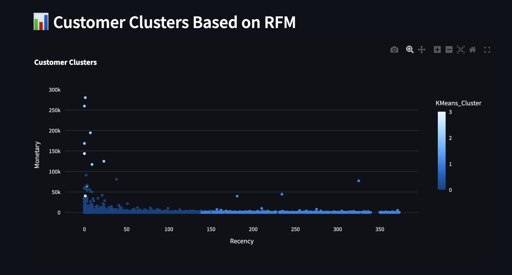
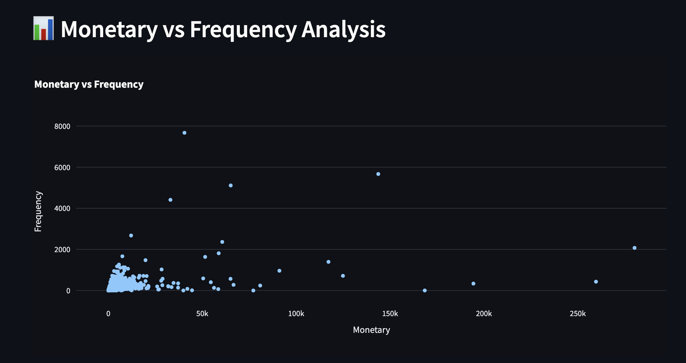
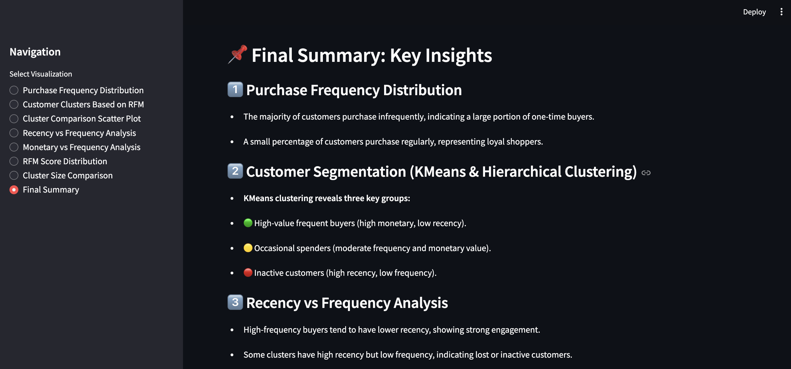

# 📊 Customer Segmentation Dashboard

## 📌 Project Overview
This project is a **customer segmentation dashboard** that helps businesses analyze customer behavior using **RFM (Recency, Frequency, Monetary) analysis**. It provides visual insights into customer purchasing patterns and segmentations.

## 🛠 Features
- 📌 **RFM Analysis** for customer segmentation  
- 📊 **Interactive visualizations** using **Streamlit & Matplotlib**  
- 📈 **Cluster analysis** with K-Means & Hierarchical clustering  
- 🔍 **Filters & comparison tools** for deeper insights  


## 📸 Screenshots
Below are some key visual insights from the dashboard:

### 1️⃣ Purchase Frequency Distribution


### 2️⃣ Recency vs Frequency Analysis


### 3️⃣ Final Summary & Insights


## 🚀 Installation & Running Locally

```bash
# Clone the repository
git clone https://github.com/yourusername/customer-segmentation-dashboard.git
cd customer-segmentation-dashboard

# Create a virtual environment
python3 -m venv venv
source venv/bin/activate  # On Windows use: venv\Scripts\activate

# Install dependencies
pip install -r requirements.txt

# Run the Streamlit app
streamlit run SCRIPTS/customer_segmentation_dashboard.py

